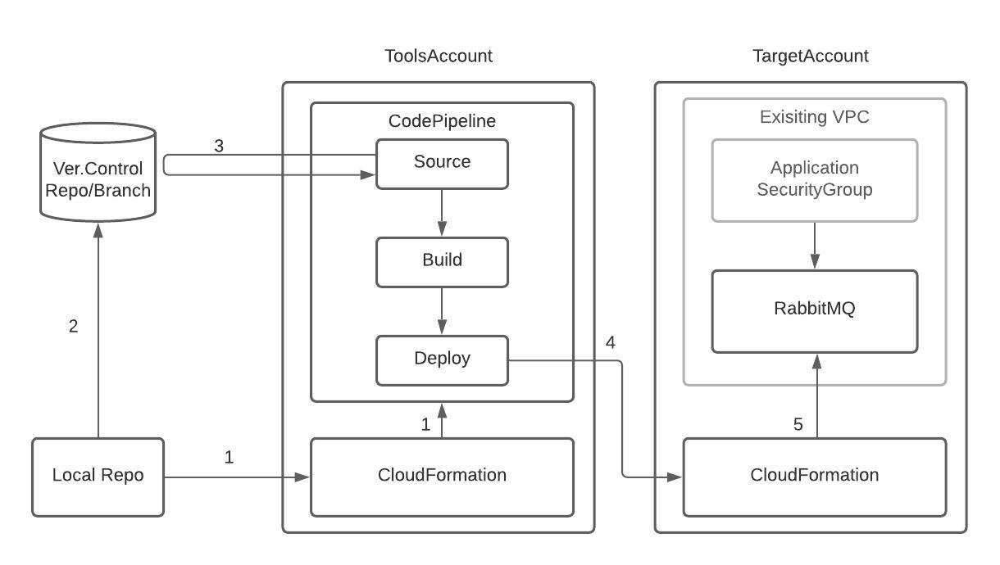

# Aligent AWS RabbitMQ stack

## Overview

AWS support RabbitMQ as a part of AmazonMQ service. This repository is for building and configuring the brokers there.

This repository defines a Node module for two AWS CDK stack modules which can be included into an environment.

1. RabbitMQPipelineStack with Cross-account deployment

    This stack configures an AWS CodePipeline application which will deploy an instance of the RabbitMQStack based on changes to the configured repository/branch.
    There are two AWS accounts involved: ToolsAccount and TargetAccount, where we don't want the TargetAccount to access to the whole version control system, e.g. BitBucket or GitHub, as they currently can't limit the access to repository level.

    

    1. Configure a CDK project on your local, run `cdk deploy` to create a CodePipeline in ToolsAccount via CloudFormation
    2. Push the project code to the repository/branch
    3. CodePipeline Source stage picks up the change in the repository/branch and initiate the pipeline
    4. CodePipeline Deploy stage initiates Target Account Cloudformation stack creation/update
    5. TargetAccount's CloudFormation creates/configures/updates RabbitMQ resources

2. RabbitMQStack

    If you don't need a pipeline or Cross-account deployment, just use this stack. See Step9 in the next section for further information.

## How to use: Creating a new RabbitMQPipelineStack project

> **_NOTE:_** npm ver.7 will cause an issue a later stage hence ver.6 is required until this issue is resolved: https://github.com/npm/cli/issues/2610

Install cdk first (`npm install -g aws-cdk`, or [this instruction](https://docs.aws.amazon.com/cdk/latest/guide/getting_started.html)) and follow the steps described below.

1. In order to have AWS ToolsAccount be able to talk to the version control system, create *CodeStar Connection*. This is a one-off task between the two, though, hence reusable across multiple projects. [Connecting to BitBucket, for example](https://docs.aws.amazon.com/dtconsole/latest/userguide/connections-create-bitbucket.html)

2. Initialise a CDK project

    $ npx cdk init app --language=typescript

3. Bootstrap the TargetAccount to grant the ToolsAccount the permission to create resources. This is per-region basis.

        $ env CDK_NEW_BOOTSTRAP=1 npx cdk bootstrap \
                --profile <TargetAccountProfile> \
                --cloudformation-execution-policies arn:aws:iam::aws:policy/AdministratorAccess \
                --trust <ToolsAccountId> \
                aws://<TargetAccountId>/<region>

4. Install this node module

        $ npm install git+https://github.com/aligent/aws-cdk-rabbitmq-stack.git

    If you want to pin down to a specific version:

        $ npm install git+https://github.com/aligent/aws-cdk-rabbitmq-stack.git#<commit/tag>

5. Replace project files

    - Replace `bin/<projectName.ts>` in the project with `sample/rabbitmq.ts` of this repo
    - Replace `lib/<projectName-stack.ts>` in the project with `sample/environments.ts` of this repo

6. Update `lib/environments.ts` with the details. You need the below information

    - CodeStar Connection ARN that was created in Step 1
    - BitBucket (or other version control system) repository/branch details
    - Existing VPC ID of the application where the RabbitMQ instance will be provisioned
    - Existing SecurityGroup of the application backend instances where the RabbitMQ instance will be accessed from
    - RabbitMQ details of your choice: Deploy mode, engine version, instance size, user credentials, etc.

7. Update `bin/rabbitmq.ts` if needed, e.g. additional environments or stack name changes.

8. Run `npm install` and update `cdk.json`:

    - `app`: replace `<project_name.ts>` with `rabbitmq.ts`.
    - `context`: add `"@aws-cdk/core:newStyleStackSynthesis": true`

9. CDK Pipeline can't handle lookups yet, including `fromLookup` method - [Ref](https://github.com/aws/aws-cdk/issues/11576#issuecomment-730351206). Build `cdk.context.json` for the TargetAccount by running `cdk synth` locally to let the pipeline have correct values:

        cdk synth --profile <TargetAccountProfile>

10. Test by running `npx cdk synth` and `npx cdk ls`. For further testing and customisation, refer to the **Local development** section below. By now you are going to see two stacks per each environment; one for Pipeline deployment, the other for direct deployment. See Step 12 down below.

11. Push the code to the relevant branch

12. Deploy the stack, e.g. `npx cdk deploy <target-RabbitMQ-environment> --profile <ToolsAccountProfile>` to create the CodePipeline, followed by TargetAccount RabbitMQ resource creation. 

    If you don't need a pipeline/cross-account deployment, deploy `<target-RabbitMQ-environment>/<target-RabbitMQ-environment>/stack` directly to the target account by `npx cdk deploy <StackName> --profile <TargetAccountProfile>`

### Connection and communication
Applications talk to RabbitMQ via amqps protocol(5671/tcp). For visual management, use SSH tunneling.
1. Add the below in your local `~/.ssh/config` file with *profile* and *path* updated (works only for SSM-enabled environments):

        host i-*
            User ec2-user
            ProxyCommand sh -c "aws --profile <TargetAccountProfile> ssm start-session --target %h --document-name AWS-StartSSHSession --parameters 'portNumber=%p'"
            IdentityFile /path/to/ssh_key/for/backend_instance

2. Find RabbitMQ endpoint hostname and the application  BE instance ID to run this command that will open a ssh connection (not an interactive shell with the `-N` flag):

        ssh -N -L <random_local_port>:<RabbitMQ_endpoint>:443 <BEInstanceID>

    for example,

        ssh -L 56710:b-abcd-ef12-3456-7890-abcdef123456.mq.ap-southeast-2.amazonaws.com:443 i-abcdef1234567890

3. Open your web browser to access to the GUI (get id/pw from environments.ts)

        https://localhost:<random_local_port_from_above>

    for example,

        https://localhost:56710

## Local development
[NPM link](https://docs.npmjs.com/cli/v7/commands/npm-link) can be used to develop the module locally.
1. Pull this repository locally
2. `cd` into this repository
3. run `npm link`
4. `cd` into the downstream repo (target project, etc) and run `npm link 'aws-rabbitmq-stack'`
The downstream repository should now include a symlink to this module. Allowing local changes to be tested before pushing.
